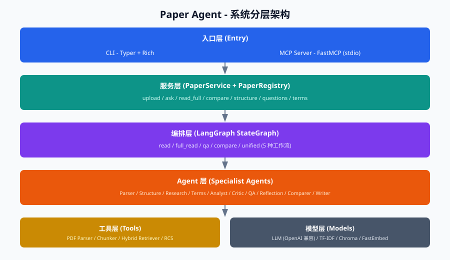
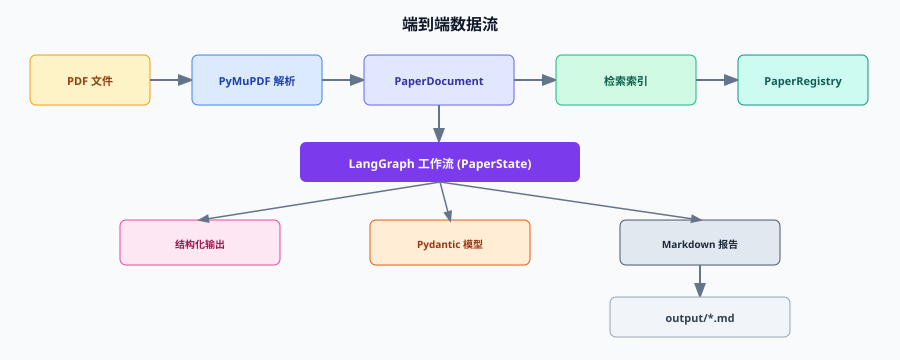
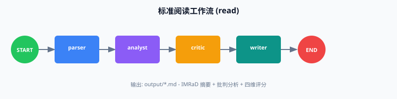
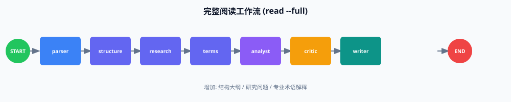
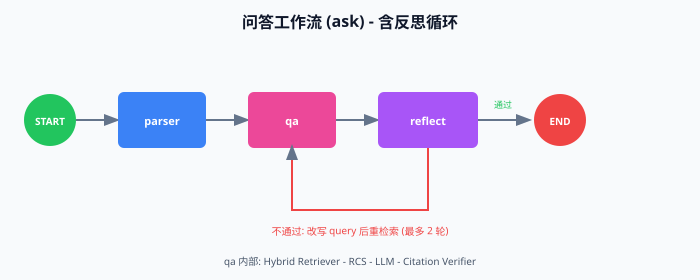
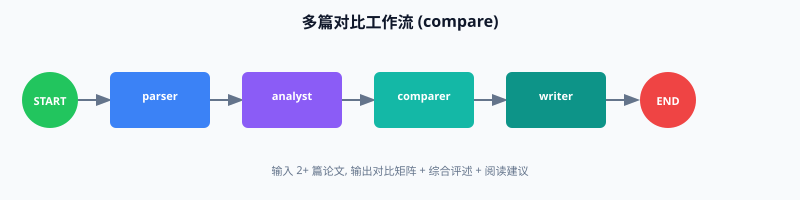
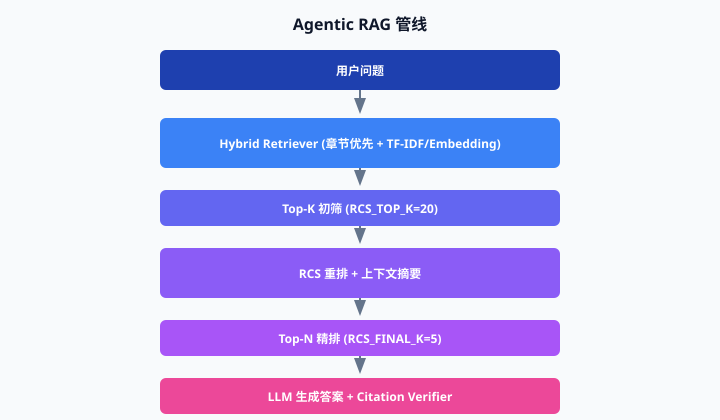

# Paper Agent - 架构与功能说明

> **文档导航**：[文档中心](README.md) | [流程详解](FLOWS.md) | [功能汇总](FEATURES.md)

## 1. 项目定位

Paper Agent 是基于 **LangGraph 多 Agent 编排** 的专业论文阅读系统，支持：

- **CLI** 命令行（Typer + Rich）
- **MCP Server**（FastMCP，供 Claude Code / Cursor 等 AI 编程工具调用）

核心能力：**PDF 解析 -> 结构化理解 -> RAG 问答 -> 批判分析 -> Markdown 报告 -> 多篇对比**

---

## 2. 系统分层架构



| 层级 | 核心模块 | 职责 |
|------|---------|------|
| 入口层 | `main.py`、`mcp_server.py` | 参数解析、进度展示、MCP 工具注册 |
| 服务层 | `paper_service.py`、`registry.py` | 统一业务 API、论文库 CRUD、缓存 |
| 编排层 | `graph/builder.py`、`router.py` | 5 种工作流图、条件路由 |
| Agent 层 | `agents/*.py` | 专业化 LLM 任务节点 |
| 工具层 | `tools/*.py` | PDF 解析、分块、检索、RCS |
| 模型层 | `llm.py`、`embeddings.py` | LLM 调用、向量/TF-IDF 索引 |

---

## 3. 端到端数据流



**paper_id 规则**：文件绝对路径 SHA256 的前 16 位（非文件名）。

---

## 4. LangGraph 工作流

详见 [FLOWS.md](FLOWS.md)。

### 4.1 标准阅读 `read`



```
START -> parser -> analyst -> critic -> writer -> END
```

### 4.2 完整阅读 `read --full`



```
START -> parser -> structure -> research -> terms -> analyst -> critic -> writer -> END
```

### 4.3 问答 `ask`



### 4.4 多篇对比 `compare`



---

## 5. Agentic RAG 管线



---

## 6. Agent 职责表

| Agent | 文件 | 职责 |
|-------|------|------|
| ParserAgent | `agents/parser.py` | PDF 解析、分块、建索引 |
| StructureAgent | `agents/specialist.py` | 章节大纲、IMRaD 映射、阅读指南 |
| ResearchAgent | `agents/specialist.py` | 研究问题与假设 |
| TerminologyAgent | `agents/specialist.py` | 术语解释 |
| AnalystAgent | `agents/analyst.py` | Map-Reduce IMRaD 摘要 |
| CriticAgent | `agents/critic.py` | 四维批判评分 |
| QAAgent | `agents/qa.py` | RAG 问答 + 引用 |
| ReflectionAgent | `agents/reflection.py` | 反思评估与重试 |
| ComparerAgent | `agents/comparer.py` | 多篇对比矩阵 |
| WriterAgent | `agents/writer.py` | Markdown 报告 |
| CitationVerifier | `agents/citation_verifier.py` | 引用验证 |

---

## 7. 数据模型

- `PaperDocument` / `Section` / `Chunk` - `models/paper.py`
- `PaperSummary` / `PaperCritique` / `QAAnswer` / `ComparisonResult` - `models/outputs.py`
- `PaperState` - `state.py`（LangGraph 状态）

---

## 8. 存储与持久化

| 路径 | 内容 |
|------|------|
| `data/papers/*.pdf` | 上传的论文副本 |
| `data/papers/index.json` | paper_id 索引 |
| `data/chroma/tfidf/*.pkl` | TF-IDF 索引 |
| `data/chroma/` | Chroma 向量库 |
| `output/` | Markdown 报告 |

---

## 9. 功能一览

完整功能分析见 [FEATURES.md](FEATURES.md)。

### CLI（9 个命令）

`upload` | `structure` | `questions` | `terms` | `ask` | `read` | `read --full` | `compare` | `mcp`

### MCP（10 个工具）

`upload_paper` | `list_papers` | `get_paper_info` | `summarize_structure` | `extract_research_questions` | `explain_terms` | `ask_paper` | `read_paper` | `compare_papers` | `upload_paper_content`

---

## 10. 技术栈

LangGraph | LangChain | PyMuPDF | Chroma + TF-IDF | Pydantic v2 | Typer + Rich | FastMCP | Jinja2

---

## 11. 已知限制

- paper_id 为路径哈希
- 无跨论文联合 QA
- 分析结果默认不持久化到磁盘
- 复杂排版 PDF 解析精度有限
- DeepSeek 自动降级 TF-IDF
